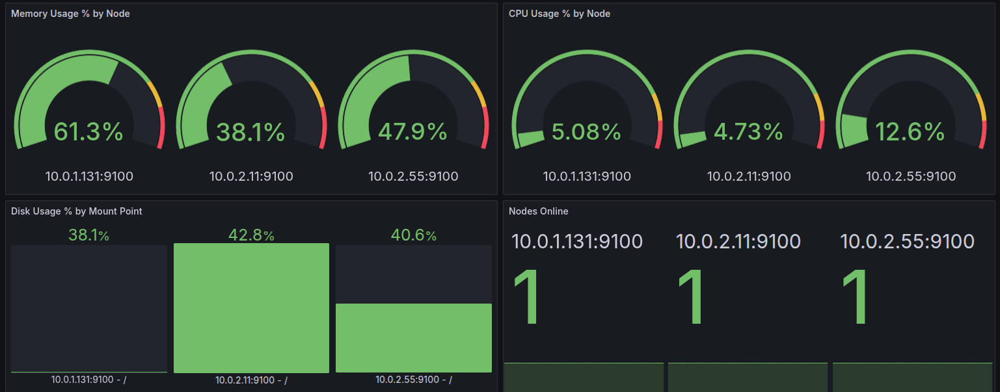
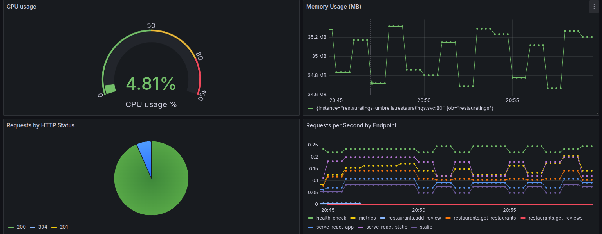
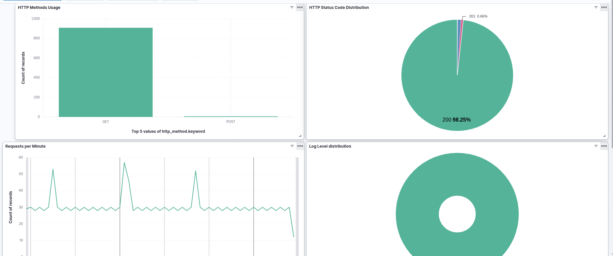

# Restauratings - Full Stack DevOps Portfolio Project

A complete restaurant review and mapping application demonstrating modern DevOps practices, GitOps methodology, and cloud-native deployment on AWS EKS.

---

## 🌐 Project Overview

**Restauratings** is a full-stack web application that showcases end-to-end DevOps practices, from local development to production deployment. Users can browse restaurants on an interactive map, submit reviews, and discover new dining experiences.

### Architecture Highlights

- **Three-tier application**: React frontend, Flask backend, MongoDB database
- **Cloud-native deployment**: AWS EKS with GitOps using ArgoCD
- **Infrastructure as Code**: Terraform for AWS resources
- **CI/CD Pipeline**: Jenkins for continuous integration, ArgoCD for continuous deployment
- **Observability**: Prometheus metrics, Grafana dashboards, EFK logging stack
- **Security**: Sealed secrets, NGINX reverse proxy, private subnets

---

## 📁 Repository Structure

```
restauratings/
├── app/                    # Full-stack application source code
│   ├── backend/           # Flask API with metrics and health endpoints
│   ├── frontend/          # React SPA with interactive map
│   ├── nginx/             # Reverse proxy configuration
│   ├── tests/             # Unit and E2E test scripts
│   ├── docker-compose.yaml # Local development environment
│   └── Jenkinsfile        # CI pipeline configuration
├── infrastructure/         # Terraform IaC for AWS EKS cluster
│   ├── main.tf            # Root Terraform configuration
│   ├── variables.tf       # Input variables and defaults
│   ├── outputs.tf         # Output values for cluster access
│   └── terraform.tfvars   # Environment-specific values
└── gitops/                # ArgoCD GitOps configurations
    ├── app-of-apps.yaml   # App-of-Apps pattern entry point
    ├── infra-apps/        # Infrastructure application manifests
    ├── restauratings-chart/ # Helm chart for main application
    ├── umbrella-chart/    # Umbrella chart for all components
    └── sealed-secrets/    # Encrypted secrets management
```

---

## 🚀 Quick Start

### Local Development

```bash
# Clone the repository
git clone <repository-url>
cd restauratings/app

# Configure environment
cp .env.example .env
# Edit .env with your configuration

# Start the application stack
docker compose up --build

# Access the application
open http://localhost
```

### Production Deployment

1. **Deploy Infrastructure**
   ```bash
   cd infrastructure/
   terraform init
   terraform plan
   terraform apply
   ```

2. **Configure kubectl**
   ```bash
   aws eks update-kubeconfig --region ap-south-1 --name yarden-eks-cluster
   ```

3. **Access ArgoCD**
   ```bash
   kubectl port-forward svc/argocd-server -n argocd 8080:443
   # Access: https://localhost:8080
   # User: admin
   # Password: $(terraform output -raw argocd_admin_password)
   ```

4. **Deploy Applications via GitOps**
   - ArgoCD automatically syncs from the `gitops/` directory
   - App-of-Apps pattern manages all infrastructure and application components

---

## 🛠️ Technology Stack

| Component | Technology | Purpose |
|-----------|------------|---------|
| **Frontend** | React, Leaflet, Axios | Interactive restaurant map and review UI |
| **Backend** | Flask, PyMongo, Prometheus | REST API with metrics and health endpoints |
| **Database** | MongoDB | Restaurant and review data storage |
| **Reverse Proxy** | NGINX | Static file serving and API routing |
| **Container Runtime** | Docker, Kubernetes | Containerization and orchestration |
| **Infrastructure** | AWS EKS, Terraform | Cloud-native Kubernetes platform |
| **CI/CD** | Jenkins, ArgoCD | Continuous integration and GitOps deployment |
| **Monitoring** | Prometheus, Grafana | Metrics collection and visualization |
| **Logging** | Elasticsearch, Fluentd, Kibana | Centralized log aggregation and analysis |
| **Security** | Sealed Secrets, AWS IAM | Secrets management and access control |

---

## 🔄 DevOps Workflow

### CI Pipeline (Jenkins)
1. **Code Commit** → Triggers Jenkins pipeline
2. **Unit Tests** → Backend and frontend test suites
3. **E2E Tests** → End-to-end application testing
4. **Build & Push** → Container images to registry
5. **Update GitOps** → Automated manifest updates

### CD Pipeline (ArgoCD)
1. **Git Sync** → ArgoCD monitors GitOps repository
2. **Drift Detection** → Automatic detection of configuration changes
3. **Self-Healing** → Automated rollback on failures
4. **Progressive Deployment** → Staged rollout with health checks

---

## 📊 Observability

### Monitoring
- **Prometheus**: Metrics collection from application and infrastructure
- **Grafana**: Custom dashboards for application performance and node monitoring
- **Health Endpoints**: `/health` and `/metrics` for application monitoring

### Logging
- **JSON Structured Logs**: Application logs formatted for easy parsing
- **EFK Stack**: Elasticsearch, Fluentd, and Kibana for log aggregation
- **Centralized Logging**: All container logs collected and indexed

### Dashboards
- Node monitoring and resource utilization
- Application-specific metrics and performance
- Log analysis and error tracking

#### Grafana – Node Monitoring


#### Grafana – Restauratings App Metrics


#### Kibana – Restauratings Logs


---

## 🌟 Key Features

### Application Features
- **Interactive Map**: Browse restaurants by location and category
- **Review System**: Submit and read restaurant reviews
- **Real-time Updates**: Dynamic content loading and updates
- **Mobile Responsive**: Optimized for all device sizes

### DevOps Features
- **GitOps Deployment**: Infrastructure and applications managed via Git
- **Automated Scaling**: Kubernetes HPA for traffic-based scaling
- **Security Best Practices**: Network segmentation, secrets encryption
- **Disaster Recovery**: Multi-AZ deployment with automated backups

---

## 🔧 Development

### Running Tests
```bash
# Backend unit tests
cd app/
./run-unit-tests.sh

# Frontend tests
cd app/frontend/
npm test

# E2E tests
cd app/tests/
./e2e.sh
```

### Adding Features
1. Develop locally using `docker-compose`
2. Write tests for new functionality
3. Submit PR for code review
4. CI pipeline validates changes
5. Merge triggers automated deployment

---

## 📖 Additional Documentation

- **Application Details**: [`app/README.md`](app/README.md)
- **Infrastructure Guide**: [`infrastructure/README.md`](infrastructure/README.md)
- **GitOps Configuration**: [`gitops/README.md`](gitops/README.md)

---

## 🏗️ Infrastructure Components

### AWS Resources
- **EKS Cluster**: Kubernetes 1.28 with managed node groups
- **VPC**: Multi-AZ setup with public/private subnets
- **Security**: IAM roles, security groups, network ACLs
- **Storage**: EBS volumes for persistent data

### Kubernetes Applications
- **ArgoCD**: GitOps controller and UI
- **Ingress NGINX**: Load balancer and SSL termination
- **Cert Manager**: Automated SSL certificate management
- **Sealed Secrets**: Encrypted secrets management
- **Monitoring Stack**: Prometheus, Grafana, AlertManager
- **Logging Stack**: Elasticsearch, Fluentd, Kibana

---

## ⚠️ Prerequisites

### Development
- Docker and Docker Compose
- Node.js 18+ and npm
- Python 3.9+ and pip

### Production Deployment
- AWS CLI configured with appropriate permissions
- Terraform >= 1.0
- kubectl
- SSH key access to GitOps repository

---

## 🤝 Contributing

1. Fork the repository
2. Create a feature branch
3. Make changes and add tests
4. Submit a pull request
5. CI pipeline will validate changes

---

## 📅 Credits

Created by **Yarden Green** as part of a comprehensive DevOps portfolio project demonstrating:
- Full-stack application development
- Cloud-native architecture
- GitOps methodology
- Infrastructure as Code
- Comprehensive observability
- Production-ready security practices

---

## 📝 License

This project is created for educational and portfolio purposes.